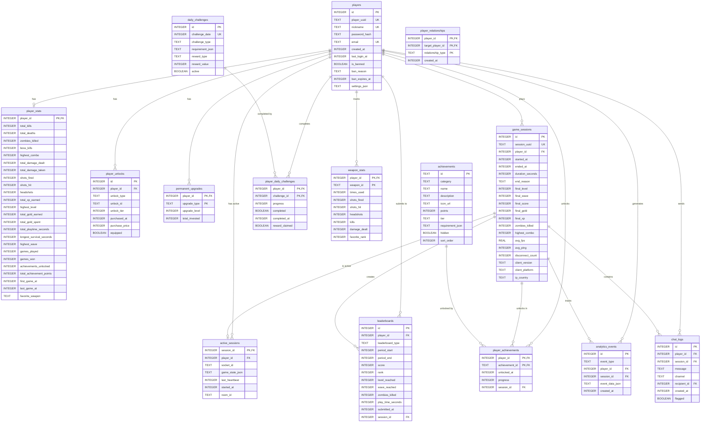

# Entity Relationship Diagram (ERD)

## Database Schema Visualization



## Key Relationships

### Core Player Data
- **players → player_stats**: 1:1 relationship
  - Each player has exactly one stats record
  - Created automatically via trigger on player creation

### Game Sessions
- **players → game_sessions**: 1:N relationship
  - One player can have many game sessions over time
  - Tracks historical gameplay data

- **game_sessions → active_sessions**: 1:0..1 relationship
  - A session can have at most one active state
  - Used for disconnect recovery
  - Automatically cleaned up when session ends

### Progression Systems
- **players → permanent_upgrades**: 1:N relationship
  - Tracks shop purchases that persist across games
  - Composite primary key (player_id, upgrade_type)

- **players → player_unlocks**: 1:N relationship
  - Weapons, skins, characters unlocked by player
  - Tracks purchase price and equipped status

### Leaderboards
- **players → leaderboards**: 1:N relationship
  - One entry per leaderboard type per period
  - Supports daily, weekly, monthly, all-time rankings
  - Composite index for fast queries

### Achievements
- **achievements → player_achievements**: N:M relationship
  - Many-to-many through junction table
  - Tracks unlock timestamp and progress
  - Linked to session that unlocked it

### Daily Challenges
- **daily_challenges → player_daily_challenges**: N:M relationship
  - Many-to-many through junction table
  - Tracks progress and completion status
  - Rewards claimed separately

## Indexes for Performance

### Primary Indexes (Automatic)
- All primary keys (PK)
- All unique constraints (UK)

### Secondary Indexes (Explicit)
```sql
-- Player lookups
CREATE INDEX idx_players_nickname ON players(nickname);
CREATE INDEX idx_players_uuid ON players(player_uuid);
CREATE INDEX idx_players_last_login ON players(last_login_at);

-- Stats queries
CREATE INDEX idx_player_stats_kills ON player_stats(total_kills);
CREATE INDEX idx_player_stats_level ON player_stats(highest_level);

-- Session tracking
CREATE INDEX idx_sessions_player ON game_sessions(player_id);
CREATE INDEX idx_sessions_started ON game_sessions(started_at);
CREATE INDEX idx_sessions_score ON game_sessions(final_score);

-- Active session recovery
CREATE INDEX idx_active_sessions_player ON active_sessions(player_id);
CREATE INDEX idx_active_sessions_heartbeat ON active_sessions(last_heartbeat);

-- Leaderboard queries (composite index)
CREATE INDEX idx_leaderboards_type_period_score
  ON leaderboards(leaderboard_type, period_start, score DESC);

-- Analytics
CREATE INDEX idx_analytics_type_time ON analytics_events(event_type, created_at);
CREATE INDEX idx_analytics_player ON analytics_events(player_id);
```

## Data Flow

### Player Registration Flow
```
1. Player connects → Socket ID
2. Check nickname in players table
3. If not exists:
   - INSERT INTO players
   - Trigger creates player_stats record
4. If exists:
   - UPDATE last_login_at
   - Load player_stats
   - Load permanent_upgrades
5. Map socket_id → player_id
```

### Game Session Flow
```
1. Player joins game
2. INSERT INTO game_sessions (started_at)
3. During gameplay:
   - Every 30s: UPSERT active_sessions (heartbeat)
   - Save game_state_json for recovery
4. On death/disconnect:
   - UPDATE game_sessions SET ended_at
   - Trigger updates player_stats automatically
   - INSERT INTO leaderboards
5. active_sessions cleaned up automatically
```

### Disconnect Recovery Flow
```
1. Player disconnects (connection lost)
2. active_sessions remains for 5 minutes
3. Player reconnects within 5 minutes:
   - SELECT FROM active_sessions WHERE player_id
   - Parse game_state_json
   - Restore player position, HP, level, gold, etc.
4. If > 5 minutes:
   - active_sessions cleaned up
   - Start fresh game
```

### Leaderboard Update Flow
```
1. Game session ends
2. Calculate final score
3. INSERT INTO leaderboards
   - One entry per leaderboard_type
   - Period_start determines time window
4. Periodically (hourly):
   - Recalculate ranks
   - UPDATE leaderboards SET rank
5. Client queries:
   - Fast lookup via composite index
   - RANK() window function for live ranking
```

## Storage Estimates

### Per Player (Typical)
- players: ~200 bytes
- player_stats: ~150 bytes
- permanent_upgrades: ~50 bytes × upgrades
- player_unlocks: ~50 bytes × unlocks
- player_achievements: ~30 bytes × achievements
- **Total: ~500-1000 bytes per player**

### Per Game Session
- game_sessions: ~150 bytes
- active_sessions: ~2000 bytes (game state JSON)
- leaderboards: ~100 bytes × 4 (daily/weekly/monthly/all-time)
- analytics_events: ~100 bytes × events
- **Total: ~500-5000 bytes per session**

### Capacity Estimates
- **1,000 players**: ~1 MB player data
- **10,000 players**: ~10 MB player data
- **100,000 sessions**: ~50-500 MB session data
- **1M leaderboard entries**: ~100 MB

**SQLite can handle databases up to 281 TB, so capacity is not a concern for most games.**

## Query Performance (With Indexes)

| Query Type | Rows | Expected Time |
|------------|------|---------------|
| Player by ID | 1 | <0.1ms |
| Player by nickname | 1 | <0.5ms |
| Player profile (with joins) | 1 | <1ms |
| Top 100 leaderboard | 100 | <2ms |
| Player sessions (last 10) | 10 | <1ms |
| Active session lookup | 1 | <0.5ms |
| Achievement progress | 50 | <2ms |
| Stats update | 1 | <1ms |

All queries use prepared statements and are optimized with proper indexes.

## Backup Strategy

### Automatic Backups
- **Daily**: Full database backup at 3 AM
- **Weekly**: Vacuum and optimize (Sunday 4 AM)
- **Retention**: Keep last 30 days of daily backups

### Backup Locations
```
./backups/
  ├── game_2024-01-01.db
  ├── game_2024-01-02.db
  └── game_2024-01-03.db
```

### Recovery Process
```bash
# Stop server
systemctl stop game-server

# Restore from backup
cp ./backups/game_2024-01-01.db ./data/game.db

# Verify integrity
sqlite3 data/game.db "PRAGMA integrity_check;"

# Restart server
systemctl start game-server
```

## Security Considerations

### SQL Injection Prevention
- **All queries use prepared statements** (parameterized queries)
- No dynamic SQL construction
- User input never directly interpolated

### Access Control
- **Row-level security**: Players can only access their own data
- **Ban system**: is_banned flag with expiration support
- **Chat moderation**: flagged column for content review

### Data Privacy
- **Password hashing**: Use bcrypt (not stored in plain text)
- **Email optional**: Not required for gameplay
- **GDPR compliance**: Easy to delete player data:
```sql
-- Delete all player data (cascades automatically)
DELETE FROM players WHERE id = ?;
```

### Audit Trail
- **analytics_events**: Tracks all significant actions
- **chat_logs**: Full chat history for moderation
- **game_sessions**: Complete gameplay history

## Maintenance Tasks

### Daily
- [x] Backup database (automatic)
- [x] Cleanup stale active_sessions (automatic)

### Weekly
- [x] VACUUM (reclaim space)
- [x] ANALYZE (update statistics)
- [ ] Review slow query log

### Monthly
- [ ] Archive old game_sessions (>90 days)
- [ ] Archive old leaderboards (>90 days)
- [ ] Review database growth
- [ ] Check fragmentation

### As Needed
- [ ] Add indexes for new query patterns
- [ ] Optimize slow queries
- [ ] Scale to PostgreSQL (if >10k concurrent users)